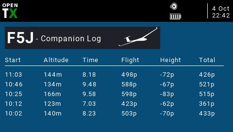

# Lua F5J trainer & logger widget for OpenTX

Download the latest version: https://raw.githubusercontent.com/knutigro/lualogger/master/Widget/

Installation:
Copy F5JComp folder and F5JLog folder to the Widgets folder.
Copy F5JComp folder to the Logs folder

Features:
 - Displays flighdata and calculate points according to F5J rules.
 - Displays data for the 5 most recent flights during current day
